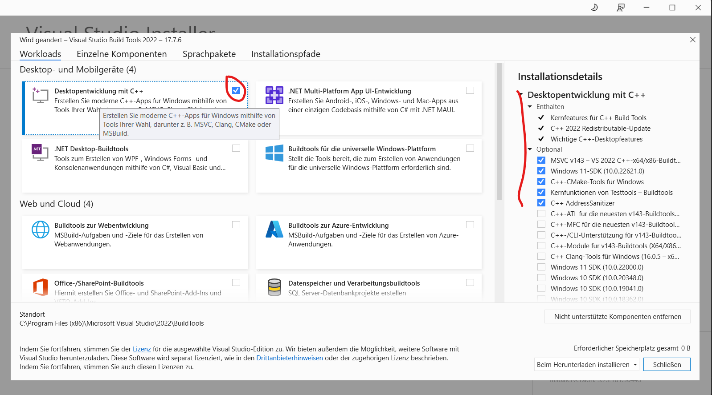

# Installation:

## Windows
Python 3.11.6

vs_buildtools.exe --norestart --passive --downloadThenInstall --includeRecommended --add Microsoft.VisualStudio.Workload.NativeDesktop --add Microsoft.VisualStudio.Workload.VCTools --add Microsoft.VisualStudio.Workload.MSBuildTools

https://visualstudio.microsoft.com/visual-cpp-build-tools/

pip install -r .\requirement.txt

## Linux
sudo apt-get install libasound2-dev

